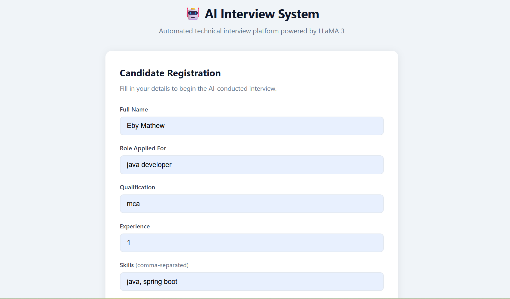
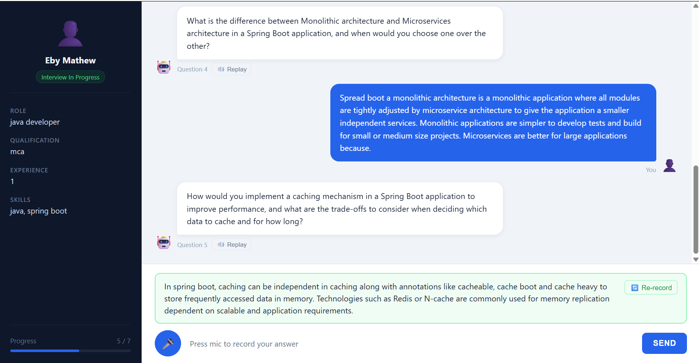
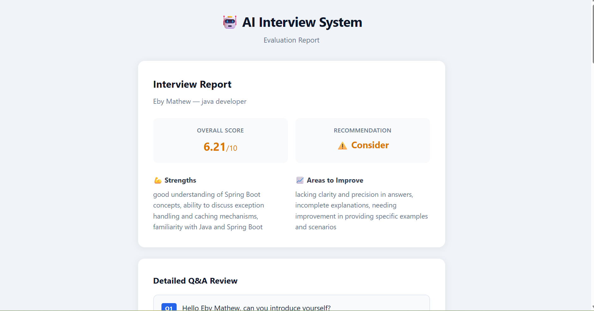

# AI Interview Platform

An intelligent, voice-enabled interview platform powered by **LangGraph**, **Groq LLM**, and **Sarvam AI**. Conducts fully automated technical interviews — asking questions via text-to-speech, transcribing candidate answers via speech-to-text, evaluating responses with an LLM, and generating a final hire/reject report.

---

## Screenshots

### Registration Page


### Interview Page


### Report Page


### LangGraph Agent Flow


---

## Features

- Candidate registration with role, skills, qualification, and experience
- Voice-based interview — questions spoken via TTS, answers recorded via mic
- Automatic speech-to-text transcription of candidate answers
- Dynamic question generation tailored to candidate profile and experience level
- Answer evaluation with score (0–10) and constructive feedback
- Adaptive difficulty — questions get harder as the interview progresses
- Final report with overall score, hire/maybe/reject recommendation, strengths, and weaknesses

---

## Tech Stack

| Layer | Technology |
|---|---|
| Backend | FastAPI |
| Agent / state machine | LangGraph |
| LLM | Groq — `llama-3.3-70b-versatile` |
| Speech to text | Sarvam AI — `saarika:v2.5` |
| Text to speech | Sarvam AI — `bulbul:v2` |
| Database | SQLite via SQLAlchemy |
| Frontend | Vanilla HTML / CSS / JavaScript |

---

## Project Structure

```
interview-system/
│   main.py                   # FastAPI app entry point
│   generate_graph.py         # Saves LangGraph agent image to assets/
│   .env                      # API keys and config
│   requirements.txt
│
├── assets/                   # Screenshots and graph image
│
├── app/
│   ├── core/                 # Config and database setup
│   ├── models/               # SQLAlchemy ORM models
│   ├── schemas/              # Pydantic request/response schemas
│   ├── graph/                # LangGraph state, prompts, graph definition
│   ├── nodes/                # Agent nodes — question gen, evaluation, report
│   ├── routes/               # FastAPI route handlers
│   └── services/             # Sarvam STT and TTS integrations
│
└── templates/                # HTML pages — registration, interview, report
```

---

## Setup and Installation

### 1. Clone the repository

```bash
git clone <your-repo-url>
cd interview-system
```

### 2. Create and activate a virtual environment

```bash
python -m venv venv

# Windows
venv\Scripts\activate

# Mac / Linux
source venv/bin/activate
```

### 3. Install dependencies

```bash
pip install -r requirements.txt
```

### 4. Configure environment variables

Create a `.env` file in the project root:

```env
GROQ_API_KEY=your_groq_api_key_here
SARVAM_API_KEY=your_sarvam_api_key_here
DATABASE_URL=sqlite:///./interview.db
TOTAL_QUESTIONS=5
LLM_MODEL=llama-3.3-70b-versatile
```

- Groq API key — https://console.groq.com
- Sarvam API key — https://dashboard.sarvam.ai

### 5. Run the application

```bash
uvicorn main:app --reload
```

Open your browser at **http://localhost:8000**

---

## API Reference

| Method | Endpoint | Description |
|---|---|---|
| POST | `/session/create` | Register candidate and open session |
| GET | `/session/{session_id}` | Fetch candidate profile |
| POST | `/agent/respond` | Central interview loop — send `answer_text: null` for first call |
| POST | `/audio-to-text` | Transcribe recorded audio |
| POST | `/text-to-audio` | Convert question text to speech |
| GET | `/report/{session_id}` | Fetch final evaluation report |

---

## Agent Flow

```
load_candidate → generate_question → [return question to user]
                        ↑
                        │ (if more questions)
evaluate_answer → check_completion
                        │ (if all done)
                        ↓
                  generate_report → END
```


---

## Generating the Agent Graph Image

```bash
pip install playwright
playwright install chromium
python generate_graph.py
```

Saves the LangGraph visual to `assets/graph.png`.

---

## Notes

- Interview state is held **in memory** between HTTP calls. Restarting the server during an active interview will lose that session's progress.
- `TOTAL_QUESTIONS` in `.env` controls interview length globally.
- STT uses `language_code: en-IN` — optimised for Indian English accents.